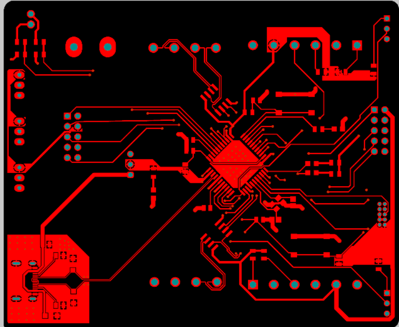
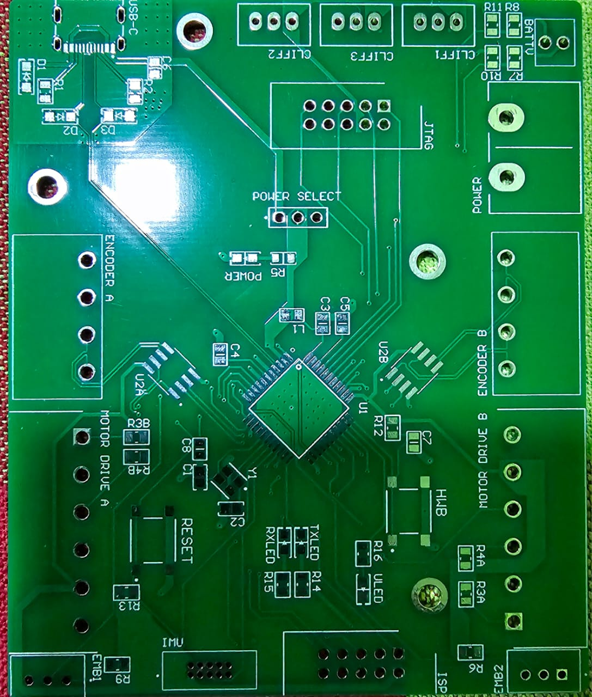
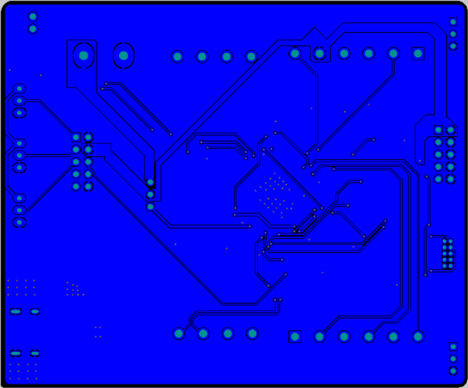
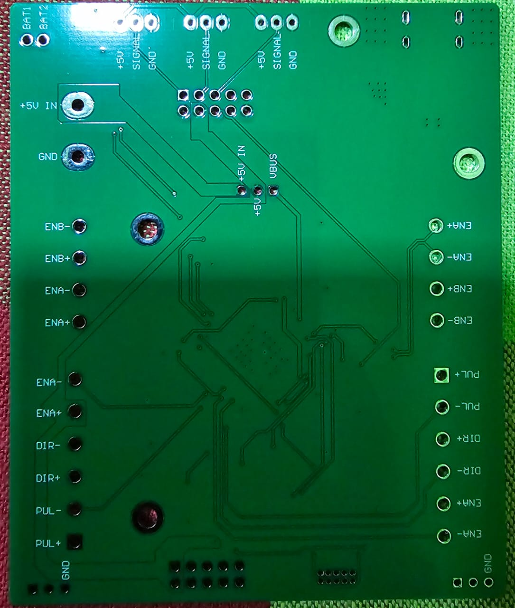
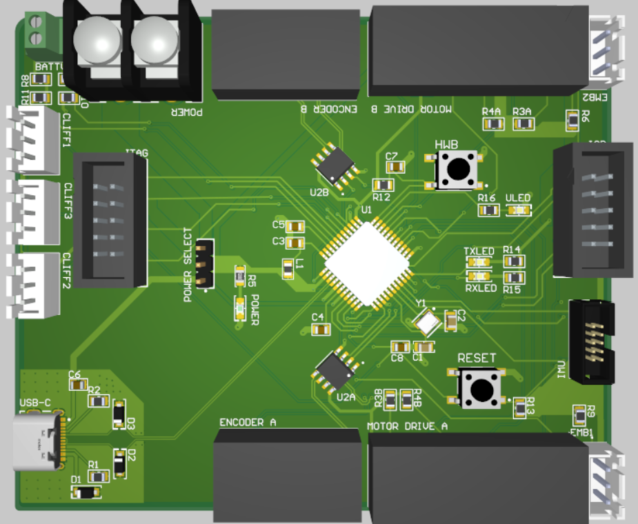

# Custom Controller Board V1.1

> **Overview**  
> A compact, USB-C–enabled controller board built around the ATmega32U4 MCU for dual-axis stepper motor control with encoder feedback, sensor integration, and flexible communication interfaces.

---

## Table of Contents

- [Features](#features)  
- [Hardware Description](#hardware-description)   
- [Schematic Organization](#schematic-organization)  
- [PCB Layout Notes](#pcb-layout-notes)  
- [Images](#images)  

---

## Features

- **Microcontroller**: ATmega32U4 (44-pin TQFP) with native USB support  
- **Power**: USB-C or external 5V supply with automatic source selection  
- **Motor Control**:  
  - Two PUL/DIR/EN outputs for CL57T V4.1 stepper drivers  
  - Differential encoder inputs via SN75157DR line receivers  
- **Sensors**:  
  - I²C interface to Adafruit BNO055 9-DOF IMU  
  - Three analog cliff sensors  
  - Dual-channel battery voltage monitoring  
- **Communication & Debug**:  
  - USB-C (full-speed USB 2.0)  
  - SPI programming header  
  - 10-pin JTAG header  
- **User Interface**: Status LEDs and push-button inputs  
- **Signal Integrity**: Controlled-impedance differential routing, proper termination, ground planes

---

## Hardware Description

This controller board integrates motion control, sensing, and communication into a single PCB:

1. **MCU Core**  
   - ATmega32U4 powered at 5V (USB or external).  
   - 16 MHz crystal oscillator with load capacitors.  
   - Decoupling and USB regulator capacitors on UVCC/UCAP.

2. **Power Management**  
   - USB-C receptacle for both data and 5V power.  
   - Diode OR’ing between USB VBUS and external 5V.  
   - Resettable fuse on VBUS, ESD protection on USB lines.

3. **Encoder Inputs**  
   - Two SN75157DR differential receivers for quad-A/B encoder signals.  
   - 120 Ω termination resistors at receiver inputs.  
   - Routed as 90–120 Ω controlled differential pairs.

4. **Sensor Interface**  
   - I²C bus with 4.7 kΩ pull-ups for BNO055 IMU.  
   - Three ADC channels for cliff sensors.  
   - Two ADC channels with voltage dividers for battery monitoring.

5. **Motor Control Outputs**  
   - Six GPIOs for PUL, DIR, EN signals to two stepper drivers.  
   - Optional buffer IC footprint for signal drive boost.

6. **Communication & Debug Headers**  
   - USB-C D+/D− lines.  
   - SPI header (SCK, MOSI, MISO, GND).  
   - Standard 10-pin JTAG header for in-circuit debugging.

7. **User Interface**  
   - Two status LEDs with 330 Ω current-limit resistors.  
   - Two push-buttons with internal/external pull-ups.

---

## Schematic Organization

- **Top Level**: Overview sheet with major modules and net labels.  
- **Sub-Sheets**:  
  1. MCU & Clock  
  2. Power & USB-C  
  3. Encoder Inputs  
  4. IMU & I²C  
  5. Analog Sensors & Monitoring  
  6. Motor Control Outputs  
  7. Communication Headers  
  8. User Interface

---

## PCB Layout Notes

1. **Layer Stackup**  
   - 2-layer: Top  / Bottom .  
   - Controlled impedance for differential pairs.

2. **Component Placement**  
   - MCU centered, decoupling caps adjacent.  
   - USB-C at edge, with clear mechanical support.  
   - Receivers near encoder connectors to minimize stub lengths.

3. **Routing Priority**  
   1. Ground plane & power pours  
   2. Differential USB & encoder pairs  
   3. Crystal/clock traces  
   4. Sensitive analog nets  
   5. SPI/JTAG and motor control lines  
   6. LEDs, buttons, headers

4. **Signal Integrity**  
   - Match differential pair lengths within ±0.1 mm.  
   - Use 45° or arcs for bends.  
   - Keep analog traces away from noisy digital/power areas.

---

## Images

<table>
  <tr>
    <td align="center">
       
      <strong>Figure 1:</strong> Top view of routing.
  </tr>
  <tr>
    <td align="center">
       
      <strong>Figure 1:</strong> Top view of the  PCB showing component placement, USB-C connector,sensor/motor headers and routing of differential pairs.
  </tr>
   <tr>
    <td align="center">
       
      <strong>Figure 3:</strong>  Bottom view  ground plane, power pours.
    </td>
  </tr>
   <tr>
    <td align="center">
       
      <strong>Figure 3:</strong>  Bottom view.
    </td>
  </tr>
  <tr>
    <td align="center">
       
      <strong>Figure 3:</strong> Top 3D view.
    </td>
  </tr>
</table>

## License

[MIT License]

